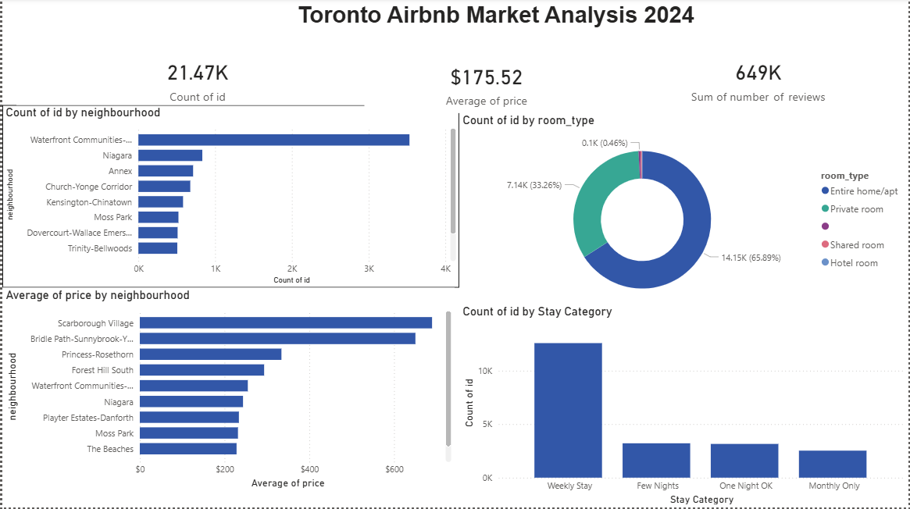

# 🏠 Toronto Airbnb Market Analysis — Power BI Dashboard

**Tool Used:** Microsoft Power BI Desktop  
**Dataset:** Inside Airbnb — Toronto Listings  
**Source:** [insideairbnb.com/toronto](http://insideairbnb.com/toronto/)  
**Total Listings Analyzed:** 21,468  
**Related Project:** [SQL Analysis →](https://github.com/rubishajya/airbnb-toronto-sql-analysis)

---

## 📊 Dashboard Preview



---

## 📌 Project Overview

This project builds on my SQL analysis of Toronto's Airbnb market by transforming the data into an interactive Power BI dashboard. The dashboard allows viewers to instantly understand pricing trends, listing distribution, room type breakdowns, and stay category patterns across Toronto neighbourhoods.

---

## 💡 Key Insights

- 🏘️ **Waterfront Communities dominates** with 3,542 listings — 4x more than any other neighbourhood
- 💰 **Average nightly price across Toronto:** $175.52
- 🏠 **66% of listings are entire homes** — Airbnb competes with Toronto's rental housing market, not hotels
- 📅 **Weekly stays are most common** (58% of all listings require 7+ night minimum)
- 👻 **Scarborough Village is most expensive** at $657/night average despite fewer listings

---

## 📈 Visuals Built

| Visual | Type | Description |
|---|---|---|
| Top 10 Neighbourhoods | Horizontal Bar Chart | Ranked by total listing count |
| Room Type Breakdown | Donut Chart | % split of entire home vs private room vs shared |
| Average Price by Neighbourhood | Horizontal Bar Chart | Top 10 most expensive areas |
| Stay Category Analysis | Column Chart | One Night / Few Nights / Weekly / Monthly |
| Total Listings | KPI Card | 21,468 total listings |
| Average Price | KPI Card | $175.52 avg nightly price |
| Total Reviews | KPI Card | Sum of all guest reviews |

---

## 🛠️ Technical Skills Demonstrated

- **Data Import & Cleaning** — Loaded raw CSV (21,468 rows) and handled data type errors
- **DAX (Data Analysis Expressions)** — Created custom calculated column to categorize stay lengths:
```
Stay Category = SWITCH( TRUE(),
    'listings'[minimum_nights] = 1, "One Night OK",
    'listings'[minimum_nights] <= 6, "Few Nights",
    'listings'[minimum_nights] <= 29, "Weekly Stay",
    "Monthly Only"
)
```
- **Interactive Filtering** — Applied Top N filters to focus on most relevant data
- **KPI Cards** — Summarized key market metrics at a glance
- **Data Formatting** — Applied currency formatting to price fields
- **Dashboard Design** — Arranged visuals with professional theme and clear hierarchy

---

## 🔗 Part of a Full Data Analysis Workflow

```
Raw Data (CSV)
     ↓
SQL Analysis (SQLite) → 10 queries, data quality fixes, business insights
     ↓
Power BI Dashboard → Interactive visuals, DAX calculations, professional design
```

This project demonstrates the ability to take data from raw CSV → SQL analysis → visual storytelling — the core workflow of a Data Analyst.

---

## 📁 Repository Contents

```
airbnb-toronto-powerbi-dashboard/
│
├── README.md
└── Toronto_Airbnb_Dashboard_Final.png
```

---

## 👩‍💻 About

**Rubisha Jyakhwo**  
Aspiring Data Analyst | HackerRank SQL Advanced Certified  
📍 London ON, Canada  
🔗 [LinkedIn](https://www.linkedin.com/in/rubisha-jyakhwo) | [SQL Project](https://github.com/rubishajya/airbnb-toronto-sql-analysis)

---

*This is Project 2 of my data analytics portfolio. Built using real Toronto Airbnb data.*
